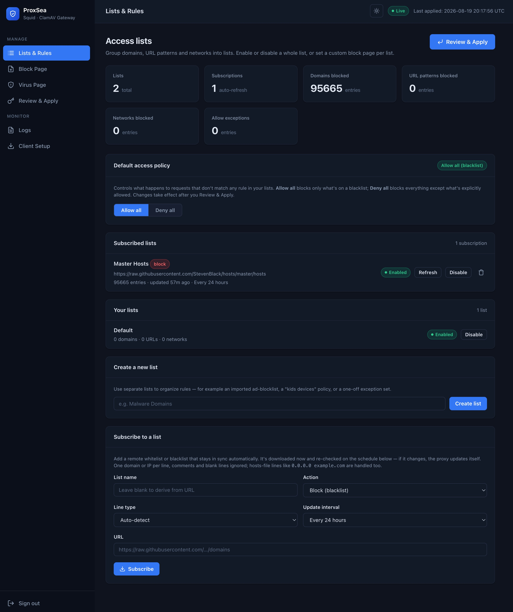

<p align="center">
  
</p>

# ProxSea

ProxSea is a self-hosted, Docker-based web proxy with SSL inspection, on-access antivirus scanning, and content filtering — all managed from a clean web dashboard.

It bundles three things that normally have to be wired together by hand:

- **[Squid](https://www.squid-cache.org/)** (built with `--enable-ssl` / `squid-openssl`) as the proxy engine, with SSL "bumping" so HTTPS traffic can be inspected, not just tunneled.
- **[ClamAV](https://www.clamav.net/)** + **[c-icap](http://c-icap.sourceforge.net/)** for on-the-fly virus scanning of downloads before they reach the client.
- A **Flask web dashboard** that generates Squid's access rules, manages allow/block lists, schedules remote blocklist subscriptions, monitors logs, and lets you customize the block pages.

> "ProxSea" = *proxy* + *sea*: a single place to watch over everything flowing through your network.

---

## QUICK START

Admin Password: changeme

!!! Do not forget to change your password !!!

```bash
git clone https://github.com/Kulutchka/ProxSea
cd ProxSea
cp .env.example .env 
docker compose -f docker-compose.prod.yml up -d
```


## Features

- **Explicit proxy** on port `3128` with SSL inspection of HTTPS (`CONNECT`) traffic.
- **Transparent intercept** ports (`3129` HTTP, `3130` HTTPS) for gateway-style deployments.
- **On-access malware scanning** — files downloaded through the proxy are checked by ClamAV via ICAP (request *and* response scanning).
- **Web dashboard** (`:8080`) for configuration — no hand-editing of `squid.conf` required.
- **Allowlists & blocklists** with support for:
  - plain domain lists
  - `hosts`-file format (`0.0.0.0 example.com`)
  - Adblock-style rules (`||example.com^`, `@@` exceptions, `$` filter options)
  - IP / CIDR ranges
  - URL-regex rules
- **Subscribed lists** (Pi-hole "gravity" style) — remote blocklists that are re-downloaded automatically on a schedule and re-applied when they change.
- **Preloaded blocklists** — a `blacklists.txt` file (one URL per line) is imported as subscriptions on first run.
- **Default access policy** — a single toggle to run in *blacklist* mode ("allow all unless blocked") or *whitelist* mode ("block all unless allowed").
- **Custom block pages** — design your own "access denied" and "virus found" pages from the dashboard.
- **Live log viewer** — watch Squid's `access.log` and `cache.log` in real time.
- **Client setup page** (`/setup`) — a public page where end users download the CA certificate and get browser-specific instructions for Windows, macOS, Linux, Firefox, Chrome, and Safari.
- **Light / dark theme** with preference persistence.

<p align="center">
  
</p>

---

## Architecture

```
                        ┌──────────────────────────────────────────┐
                        │              proxsea-proxy               │
                        │  (Ubuntu + Squid + c-icap + ClamAV)      │
                        │                                          │
 Clients ──► :3128 ────►│  Squid (SSL-bump) ──► ICAP ──► ClamAV    │──► Internet
 (browsers)  :3129/3130 │      │                     (clamd)       │
                        │      └── access rules from managed/      │
                        │          rules.conf                      │
                        └──────────────┬───────────────────────────┘
                                       │ shared volume
                                       │ (squid_managed_config, squid_logs, ssl_cert_data)
                        ┌──────────────▼───────────────────────────┐
                        │             proxsea-dashboard            │
                        │   (Flask + SQLite + gunicorn, :5000→8080) │
                        │   writes rules.conf, lists, error pages  │
                        │   reads logs, serves /setup CA download  │
                        └──────────────────────────────────────────┘
```

The two containers communicate through Docker named volumes:

| Volume | Purpose |
| --- | --- |
| `squid_managed_config` | Dashboard writes `rules.conf`, list files, and custom error/virus pages; the proxy's config-watcher reloads Squid on change. |
| `squid_logs` | Squid's `access.log` and `cache.log`, read by the dashboard's log viewer. |
| `ssl_cert_data` | The generated CA certificate/key. Persisted so clients stay trusted across restarts. |
| `clamav_data` | ClamAV virus signatures (avoids re-downloading ~110 MB on every restart). |
| `dashboard_data` | The dashboard's own SQLite database (lists, entries, settings, password hash). |

---

## Requirements

- **Docker** (Engine + Compose v2). `docker compose` must work on your host.
- ~**2 GB RAM** recommended (ClamAV signature loading is the biggest consumer).
- ~**1 GB disk** for the images, plus space for ClamAV signatures (~300 MB) and Squid's SSL cache.

### Raspberry Pi (ARM / SD card)

ProxSea is fully ARM-compatible — both images build and run on `arm64` with no changes. Use a **64-bit OS** (Raspberry Pi OS 64-bit or Ubuntu Server for arm64); Ubuntu 24.04 no longer ships 32-bit `armhf`, so a 32-bit OS or Pi 1/Zero won't work.

The real constraint on a Pi is **RAM and SD-card wear**, not CPU:

- **RAM** — ClamAV loads ~300–500 MB of signatures into memory. Use a **Pi 4/5 with 4 GB+**; a 1 GB model will likely OOM once `clamd` finishes loading.
- **SD-card wear** — the project already routes the write-heavy paths to RAM for you:
  - Squid's **disk cache is disabled** (`cache_dir` is not configured), since SSL-bumped HTTPS is largely uncacheable anyway.
  - Squid's **logs** live on a `tmpfs`-backed shared volume (still visible in the dashboard's live log viewer, but never written to the SD card).
  - The SSL certificate cache (`/var/lib/squid/ssl_db`) and Squid's spool directory are mounted as `tmpfs`.

For the best experience, boot from a USB SSD and, if possible, move Docker's data root and the `clamav_data` volume there too. The ClamAV signature volume is the one thing kept on persistent storage (re-downloading ~300 MB on every boot is worse than the occasional write `freshclam` makes).

---

## Installation

### 1. Clone the repository

```bash
git clone <your-repo-url> proxsea
cd proxsea
```

(Or copy the project directory to your server.)

### 2. Set your password

Edit `docker-compose.yml` and change the dashboard password before first start:

```yaml
  dashboard:
    environment:
      - DASHBOARD_PASSWORD=change-me-dashboard   # initial dashboard login
```

> `DASHBOARD_PASSWORD` sets the *initial* admin password only; after first login you can change it from the dashboard.

Optional, but recommended:

- `DASHBOARD_SECRET_KEY` — pin a random string so dashboard login sessions survive container restarts (otherwise a fresh key is generated each boot and everyone is logged out).
- `PROXY_HOST` / `PROXY_PORT` — your server's LAN IP/hostname and the proxy port, shown copy-paste-ready on the public Client Setup page.

### 3. (Optional) Configure preloaded blocklists

Edit `blacklists.txt` — one URL per line. Blank lines and lines starting with `#`, `!`, or `;` are ignored. On **first run** each URL becomes a "Subscribed list" (block) that refreshes every 24 hours.

```text
# example blacklists.txt
https://raw.githubusercontent.com/StevenBlack/hosts/master/hosts
https://raw.githubusercontent.com/hagezi/dns-blocklists/refs/heads/main/adblock/fake.txt
```

### 4. Build and start

```bash
docker compose up -d --build
```

The first build takes a few minutes (compiling/installing Squid, ClamAV, etc.). On **first start** the proxy container:

1. Generates a fresh CA certificate and saves it to the `ssl_cert_data` volume.
2. Downloads ClamAV virus signatures (can take a minute or two).
3. Seeds default error pages and a permissive `rules.conf`.
4. Imports any URLs from `blacklists.txt` as block subscriptions.

Check that both containers came up:

```bash
docker compose ps
docker compose logs -f
```

### 5. Log in to the dashboard

Open **http://your-server-ip:8080** and log in with the `DASHBOARD_PASSWORD` you set (default `changeme` — change it).

---

## Production deployment (prebuilt images)

Instead of building locally, you can run ProxSea from the prebuilt images published to GitHub Container Registry (GHCR) by the [`build`](.github/workflows/build.yml) workflow.

```bash
docker compose -f docker-compose.prod.yml up -d
```

`docker-compose.prod.yml` is identical to `docker-compose.yml` except that each service pulls a GHCR image instead of a build context:

| Service | Image |
| --- | --- |
| `ssl-proxy` | `ghcr.io/kulutchka/proxsea-proxy` |
| `dashboard` | `ghcr.io/kulutchka/proxsea-dashboard` |

By default it tracks `latest` (the `main` branch). Pin a release tag with the `PROXSEA_VERSION` variable:

```bash
PROXSEA_VERSION=v1.0.0 docker compose -f docker-compose.prod.yml up -d
```

or in a `.env` file next to the compose file:

```text
PROXSEA_VERSION=v1.0.0
```

The workflow tags images with `latest` (main only), the branch name, the version tag (`v*`), and the commit SHA — so you can pin to any of those.

---

## Configuration

### Default access policy

On the dashboard home page, choose between:

- **Allow all / Blacklist mode** — everything is allowed except what's on a block list.
- **Block all / Whitelist mode** — everything is blocked except what's on an allow list.

After changing any list or setting, click **Apply** to write `rules.conf` and reload Squid (the dashboard shows a pending-changes indicator until you do).

### Allowlists & blocklists

From the dashboard you can:

- Create lists and add domains, IPs/CIDRs, and URL-regexes.
- **Import** a remote list (hosts file, plain domains, or Adblock syntax).
- **Subscribe** to a remote list with a refresh interval (6h–7d), which is re-downloaded and auto-applied when it changes — the same behavior as Pi-hole's gravity scheduler.

Adblock `@@` exception rules are honored: a `@@||example.com^` line in a block list becomes an *allow* carve-out.

### Client setup

Point end users at **http://your-server-ip:8080/setup** (no login required). The page provides:

- The `squidCA.der` CA certificate download (needed to trust SSL-inspected HTTPS).
- Step-by-step trust instructions for **Windows, macOS, and Linux**.
- Proxy configuration instructions for **Firefox, Chrome, and Safari**.

Then configure clients to use the proxy:

- **Explicit proxy:** host `your-server-ip`, port `3128`.
- **Transparent interception:** point clients' default gateway at the proxy host (or use the intercept ports `3129`/`3130` with appropriate iptables/routing).

> Note: HTTPS inspection only works for clients that trust the generated CA. Clients that don't install the CA will see certificate warnings for every HTTPS site.

---

## Ports

| Port | Service | Notes |
| --- | --- | --- |
| `3128` | Squid explicit proxy | HTTP + SSL-bumped HTTPS (`CONNECT`) |
| `3129` | Squid transparent HTTP intercept | |
| `3130` | Squid transparent HTTPS intercept | SSL bump |
| `8080` | Dashboard web UI | maps to `:5000` in the container |
| `1344` | c-icap (ICAP) | internal; not published by default |

---

## Upgrading

```bash
git pull
docker compose up -d --build
```

Named volumes (`ssl_cert_data`, `clamav_data`, `squid_managed_config`, `dashboard_data`, `squid_logs`) are preserved across rebuilds, so your CA, signatures, and rules survive.

> The CA certificate is stored on a volume. **Do not delete the `ssl_cert_data` volume** after clients have installed the CA — a new CA would require re-installing it on every client.

To reset everything (including the CA and dashboard database):

```bash
docker compose down -v
```

---

## Environment variables

| Variable | Service | Default | Description |
| --- | --- | --- | --- |
| `DASHBOARD_PASSWORD` | dashboard | `changeme` | Initial admin password (first run only). |
| `DASHBOARD_SECRET_KEY` | dashboard | *(random)* | Session secret; pin it to persist logins across restarts. |
| `PROXY_HOST` | dashboard | *(blank)* | Proxy hostname/IP shown on the Client Setup page. |
| `PROXY_PORT` | dashboard | `3128` | Proxy port shown on the Client Setup page. |

---

## Troubleshooting

- **Clients get certificate warnings** — they haven't installed/trusted the CA yet. Visit `/setup` and follow the instructions.
- **`database is locked` / dashboard crashes on large list import** — make sure you're on the latest image; imports are batched and SQLite runs in WAL mode.
- **Squid won't start** — check `docker compose logs ssl-proxy`. On first boot, ClamAV signature download can take a while; Squid's ICAP handshake waits for `clamd` to be ready.
- **Virus pages render blank** — the `virus_found.html` template is seeded on first boot; saving a custom virus page from the dashboard rewrites it.
- **Dashboard logs everyone out on restart** — set `DASHBOARD_SECRET_KEY`.

---

## Disclaimer

**This software is provided "as is", without warranty of any kind**, express or implied, including but not limited to the warranties of merchantability, fitness for a particular purpose, and noninfringement. See the [Apache License 2.0](LICENSE) for the full terms.

Specific to this project:

- **SSL inspection is a man-in-the-middle by design.** ProxSea intercepts and re-encrypts HTTPS traffic using a locally generated CA. Use it **only on networks and devices you own or are explicitly authorized to manage**. Intercepting traffic you do not own may violate laws, terms of service, or your organization's policies.
- **It is not a substitute for endpoint security.** ClamAV signature-based scanning catches known malware but cannot detect zero-day, encrypted, or obfuscated threats, and is only as good as its signature database (which must be kept up to date).
- **You are responsible for securing the deployment.** The defaults (e.g. `sslproxy_cert_error allow all`, `changeme` passwords, exposed ports) are intended to get a lab running, not for production. Change passwords, restrict network exposure, review the Squid configuration, and install/rotate the CA appropriately.
- **Respect the licenses and terms of any third-party blocklists** you subscribe to, and do not redistribute content you are not authorized to redistribute.
- The authors assume **no liability** for any damage, data loss, security breach, legal issue, or other consequences arising from the use of this software.

---

## License

Licensed under the [Apache License, Version 2.0](LICENSE).
